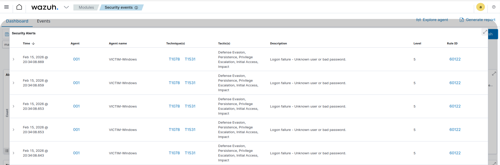
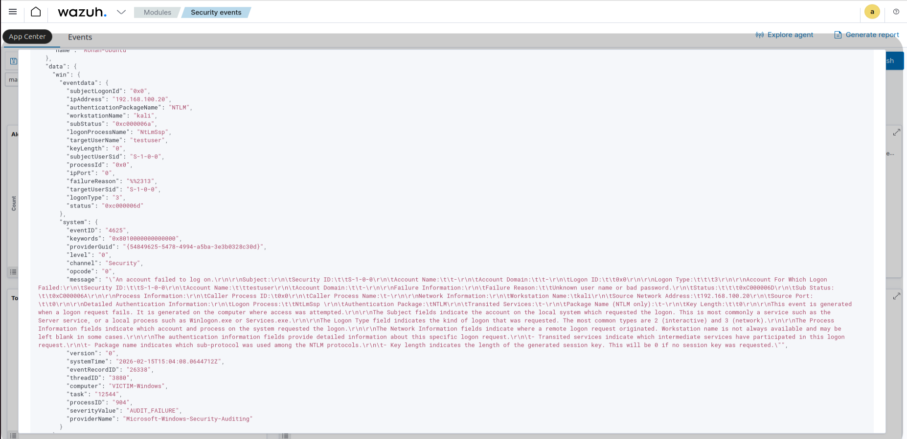

# Project 1: Windows Brute Force Detection using Wazuh SIEM

## Objective

To simulate a brute-force attack against a Windows machine and detect the activity using Wazuh SIEM.

---

## 1. Lab Architecture

- Kali Linux (Attacker) – 192.168.100.20
- Windows 11 (Victim) – 192.168.100.10
- Ubuntu + Wazuh (SIEM) – 192.168.100.5

---

## 2. Lab Overview

---

## 3. Network Configuration

### Windows IP

### Kali IP

### Ubuntu IP

---

## 4. Wazuh Agent Status

Windows agent successfully connected to Wazuh Manager.

---

## 5. Attack Simulation

A brute-force attack was simulated against the Windows RDP service (port 3389).

### Tool Used
- xfreerdp (Kali Linux)

### Command Used

for i in {1..20}; do xfreerdp3 /cert:ignore /v:192.168.100.10 /u:testuser /p:WrongPassword123; done

### Objective

To generate multiple failed login attempts within a short time window to simulate brute-force behavior.

### Evidence

---

## 6. Detection in Wazuh

Wazuh successfully detected multiple failed login attempts from the attacker machine.

### Event Details

- Event ID: 4625 (Failed Logon)
- Source IP: 192.168.100.20
- Target User: testuser
- Logon Type: 10 (Remote Interactive - RDP)
- Time Window: Multiple failures within seconds

### Log Spike (Table View)

### Detailed Log Analysis

---

## 7. MITRE ATT&CK Mapping

Technique: T1110 – Brute Force

The attacker attempted repeated authentication attempts against a remote service (RDP) to gain unauthorized access.

## 8. Incident Analysis

The activity observed matches brute-force behavior:

- Repeated authentication failures
- Same source IP
- Same target user
- High frequency within short timeframe

No successful login was observed.

This activity would trigger alerting mechanisms in a real SOC environment.
