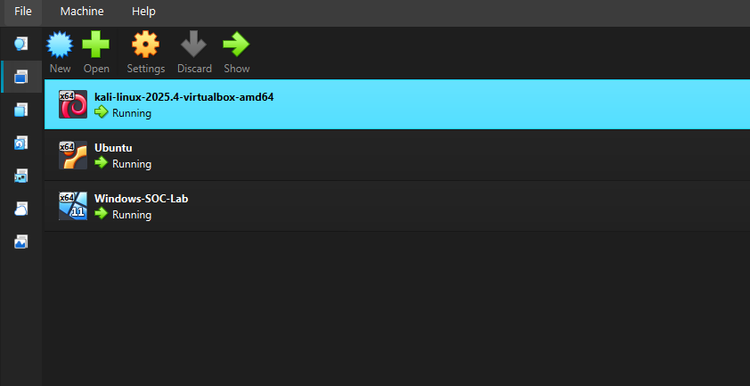
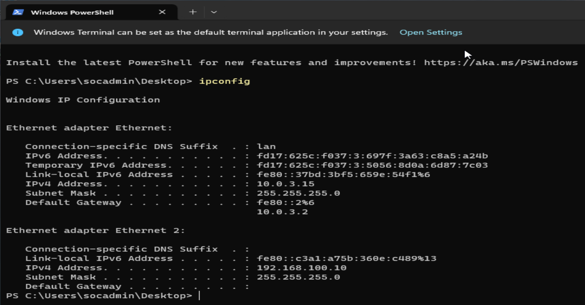
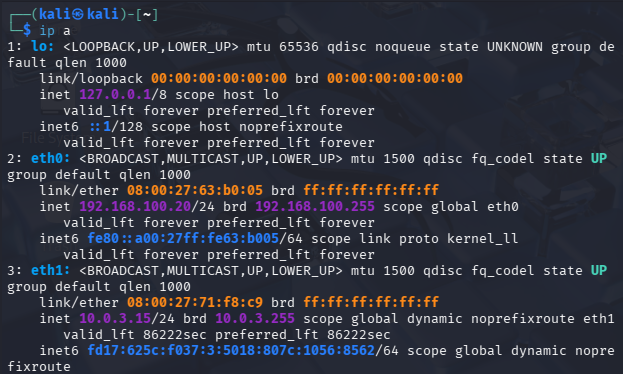
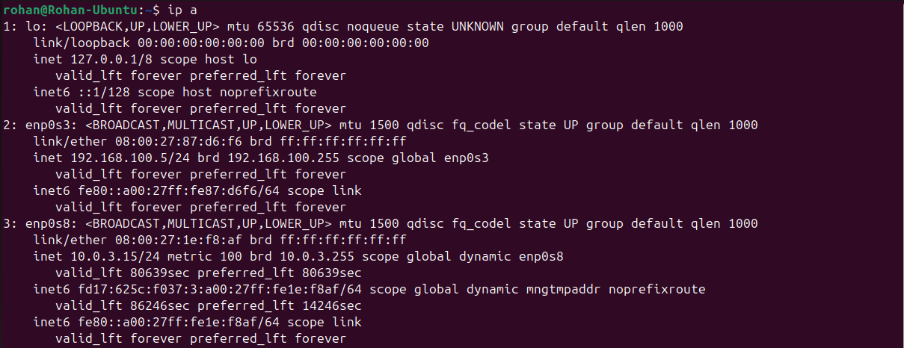

# Project 1: Windows Brute Force Detection using Wazuh SIEM

## Objective

To simulate a brute-force attack against a Windows machine and detect the activity using Wazuh SIEM.

---

## 1. Lab Architecture

- Kali Linux (Attacker) – 192.168.100.20
- Windows 11 (Victim) – 192.168.100.10
- Ubuntu + Wazuh (SIEM) – 192.168.100.5

---

## 2. Lab Overview

---

## 3. Network Configuration

### Windows IP

### Kali IP

### Ubuntu IP

---

## 4. Wazuh Agent Status

Windows agent successfully connected to Wazuh Manager.

---

## 5. Attack Simulation

(To be added after brute-force execution)

---

## 6. Detection & Analysis

(To be added after detection evidence)

---

## 7. Incident Response

(To be added)
